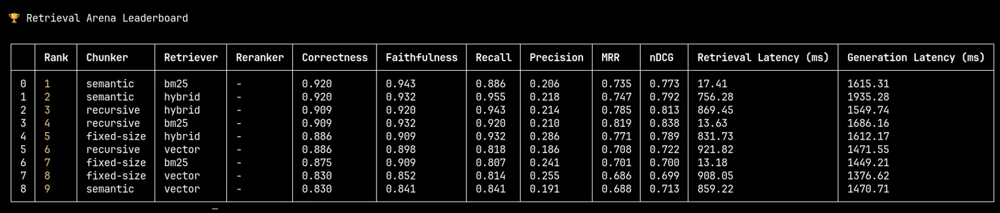
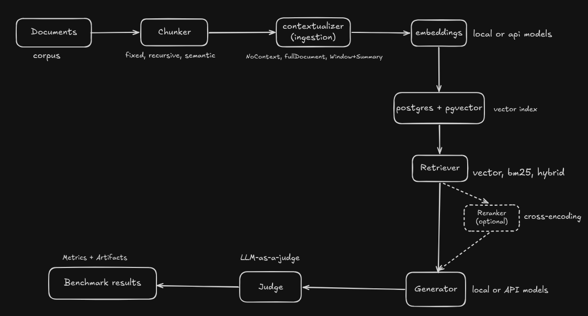
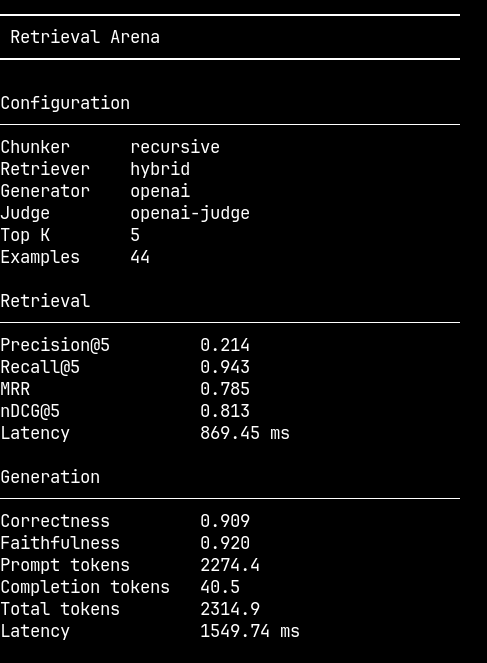

# Retrieval Arena

An eval-driven RAG and context engineering framework that measures retrieval quality as rigorously as you'd measure API latency.
<!-- badges: build, license, bun, typescript -->

<p align="center">
   
  <br>
  <em>Screenshot: `bun run src/cli/index.ts compare` output</em>
</p>


## Table of contents

- [Why this exists](#why-this-exists)
- [Features](#features)
- [Architecture](#architecture)
- [Installation](#installation)
- [Quick start](#quick-start)
- [CLI usage](#cli-usage)
- [Benchmarking](#benchmarking)
- [Evaluation metrics](#evaluation-metrics)
- [Benchmark artifacts](#benchmark-artifacts)
- [Extending the framework](#extending-the-framework)
- [Design philosophy](#design-philosophy)
- [Roadmap](#roadmap)
- [Contributing](#contributing)
- [License](#license)

## Why this exists

Most RAG tutorials show you a chunker, an embedder, and a retriever wired together, and stop there. They don't tell you whether recursive chunking actually beats fixed-size chunking for your corpus, whether a reranker is worth the added latency, or whether your "improvement" is signal or noise from a 10-example eval set.

Retrieval Arena treats retrieval-augmented generation as something you benchmark, not something you assemble once and trust. Every component — chunker, contextualizer, retriever, reranker, generator, judge — is swappable, and every configuration is scored against the same golden dataset using the same metrics, so comparisons are apples-to-apples instead of vibes-to-vibes.

## Features

- **Pluggable pipeline** — chunker, contextualizer, embedder, retriever, reranker, generator, and judge are each independent, swappable components.
- **Multiple chunking strategies** — fixed-size, recursive (header → paragraph → sentence → fixed-size fallback), and semantic chunking out of the box.
- **Context enrichment strategies** — `NoContext`, `fullDocument`, and `Window+Summary` contextualization before embedding.
- **Hybrid retrieval** — vector, BM25, and hybrid (vector + BM25 fusion) retrievers backed by Postgres + pgvector.
- **Optional reranking** — cross-encoder reranking as a post-retrieval step, off by default so its cost/benefit is measurable rather than assumed.
- **Separated evaluation** — retrieval quality (precision, recall, MRR, nDCG) and generation quality (correctness, faithfulness via LLM-as-a-judge) are scored independently, so a bad end-to-end score tells you *which* stage failed.
- **Reproducible benchmark artifacts** — every run's configuration, per-example results, and aggregate summary are written to disk, not just printed to a terminal.
- **Leaderboard comparison** — Compare benchmark runs across multiple pipeline configurations.

## Architecture

<p align="center">
  
  <br />
  <em>High-level Retrieval Arena benchmarking pipeline.</em>
</p>


### Component responsibilities

| Stage | Responsibility |
|---|---|
| Chunker | Splits raw documents into retrievable units. Each chunker tags its output with a `strategy` field, so eval results can be sliced by chunking method without re-running anything. |
| Contextualizer | Enriches a chunk with surrounding context before it's embedded — nothing, the full source document, or a windowed summary — because chunk-level embeddings frequently lose the context that made the chunk relevant in the first place. |
| Embeddings | Turns (chunk + context) into vectors. Supports local and API-backed embedding models behind one interface. |
| Postgres + pgvector | Stores vectors and metadata behind a single, boring, well-understood index rather than adding a dedicated vector database dependency. |
| Retriever | Given a query, returns ranked candidates. Vector, BM25, and hybrid retrievers share a `RetrievalResult[]` output shape so downstream stages don't need to know which one ran. |
| Reranker | An optional cross-encoder pass over the retriever's candidates. It's a separate stage rather than baked into the retriever so its marginal effect on quality and latency shows up as its own leaderboard column. |
| Generator | Produces an answer from the retrieved context. Local and API-backed models share an interface. |
| Judge | Scores the generator's output for correctness and faithfulness against the golden answer, independent of the retrieval metrics above it. |

### Why the retrieval and generation stages are evaluated separately

A single end-to-end "accuracy" score can't tell you whether a bad answer came from retrieving the wrong chunks or from the generator hallucinating on top of the right ones. Retrieval Arena scores retrieval (precision@k, recall@k, MRR, nDCG@k) and generation (correctness, faithfulness) as two independent evaluations against the same golden dataset, so a regression in the leaderboard points you at a stage, not just a number.

### Why every component is replaceable

Chunking strategy, context strategy, retriever, and reranker all compose through the same interfaces. This is deliberate: the point of the framework is to answer "does X actually help," and that question only has an answer if X can be swapped in and out without touching anything else in the pipeline.

## Installation

> Requires [Bun](https://bun.sh) and a Postgres instance with the `pgvector` extension.

```bash
git clone https://github.com/<org>/retrieval-arena.git
cd retrieval-arena
bun install
```

Configure your database and model provider credentials (see `.env.example`).

## Quick start

```bash
# Run the full comparison across all configured chunker/retriever combinations
bun run src/cli/index.ts compare
```

```
🏆 Retrieval Arena Leaderboard

   Rank  Chunker    Retriever  Reranker  Correctness  Faithfulness  Recall  Precision  MRR    nDCG   Retrieval Latency (ms)  Generation Latency (ms)
1  1     semantic   bm25       -         0.920        0.943         0.886   0.206      0.735  0.773  17.41                   1615.31
2  2     semantic   hybrid     -         0.920        0.932         0.955   0.218      0.747  0.792  756.28                  1935.28
3  3     recursive  hybrid     -         0.909        0.920         0.943   0.214      0.785  0.813  869.45                  1549.74
...
```

The leaderboard ranks every configuration in the run against the same 44-example golden dataset, so a semantic/BM25 combination scoring highest on correctness while a fixed-size/vector combination trails isn't a coincidence you have to go digging for — it's the point of the table.

## CLI Usage

| Command | Description |
|---------|-------------|
| `bun run src/cli/index.ts benchmark --chunker recursive --retriever hybrid --k 5` | Runs a benchmark for the specified pipeline configuration, evaluates it on the configured dataset, prints retrieval and generation metrics, and saves reproducible benchmark artifacts (`config.json`, `summary.json`, `evaluations.json`). |
| `bun run src/cli/index.ts compare` | Loads all saved benchmark artifacts from the `results/` directory and displays a ranked leaderboard comparing retrieval quality, generation quality, latency, and other evaluation metrics across benchmark runs. |

Each row corresponds to one full pipeline configuration, evaluated independently. Retrieval metrics and generation metrics are reported side by side, along with retrieval and generation latency, so cost and quality trade-offs are visible in the same view.

## Benchmarking

A benchmark run in Retrieval Arena is: pick a configuration (chunker, contextualizer, retriever, optional reranker, generator, judge), run it against the golden dataset, and score retrieval and generation independently.

<p align="center">
  
  <br />
  <em>Example benchmark output for a Recursive + Hybrid retrieval pipeline.</em>
</p>

This is the same information as one row of the leaderboard, expanded into a single-configuration report — useful when you want to inspect one setup in detail rather than compare across many.

### Why benchmarks are reproducible

Every run is scored against the same fixed golden dataset (44 hand-reviewed queries with evidence spans) using the same metric implementations. Nothing about the pipeline is randomized between comparable runs, so a leaderboard generated today should reproduce the same numbers next week, and a regression after a code change is attributable to the change rather than to eval noise.

## Evaluation metrics

### Retrieval metrics

| Metric | What it measures | Why it matters |
|---|---|---|
| Precision@k | Of the top-k chunks retrieved, how many were actually relevant. | Low precision means the generator is being handed noise it has to filter out on its own. |
| Recall@k | Of all relevant chunks for the query, how many made it into the top-k. | If the right chunk was never retrieved, no generator or reranker downstream can fix the answer. |
| MRR | How high up the first relevant result lands, averaged across queries. | Cheap proxy for "did the retriever put the right thing near the top," which matters when only the first few chunks make it into the prompt. |
| nDCG@k | Like MRR, but accounts for multiple relevant chunks at different ranks, weighted by position. | Distinguishes "got the one relevant chunk to rank 1" from "buried it at rank 5," even when recall is identical. |

### Generation metrics

| Metric | What it measures | Why it matters |
|---|---|---|
| Correctness | Whether the generated answer matches the golden answer, as judged by an LLM judge. | The metric people actually care about — did the system answer the question. |
| Faithfulness | Whether the generated answer is actually supported by the retrieved context, rather than the model's own knowledge. | Separates "correct because retrieval worked" from "correct despite retrieval, because the model already knew the answer" — the second case will fail silently on out-of-distribution queries. |

## Benchmark artifacts

Every run writes its results to `results/<config-name>/`:

```
results/
  semantic-hybrid/
    config.json        # exact configuration used for the run
    summary.json        # aggregate retrieval + generation metrics
    evaluations.json    # per-example scores and outputs
```

Artifacts are persisted rather than just printed so that a leaderboard result can be re-inspected, diffed against a later run, or fed into an external analysis without re-running the pipeline.

## Extending the framework

Every stage in the pipeline is added the same way: implement the stage's interface, register it, and it becomes selectable as a configuration option in `compare`.

| Component | Where it plugs in |
|---|---|
| Chunker | Implements the chunking interface and tags output with a `strategy` field for eval attribution. |
| Contextualizer | Takes a chunk and returns an enriched version before embedding. |
| Retriever | Takes a query and returns `RetrievalResult[]` with rank and score — the shape every downstream stage expects. |
| Reranker | Takes retriever output and returns a re-ordered `RetrievalResult[]`. Optional by design — a config can omit it entirely. |
| Generator | Takes assembled context and returns an answer. |
| Judge | Takes a generated answer, the golden answer, and the retrieved context, and returns correctness + faithfulness scores. |

New components don't require changes elsewhere in the pipeline — that's the reason each stage communicates through a fixed intermediate shape instead of passing internal state forward.

## Design philosophy

- **Measure, don't assume.** Every architectural choice in a RAG pipeline — chunking strategy, whether to rerank, how much context to attach — is treated as a hypothesis to benchmark, not a best practice to inherit.
- **Retrieval and generation fail differently, so they're scored differently.** Collapsing them into one number hides which stage needs work.
- **Every run is a reproducible artifact**, not a number that lives only in a terminal scrollback.
- **Boring infrastructure.** Postgres + pgvector instead of a bespoke vector store, because the interesting problem here is evaluation, not infrastructure.


## License

This project is licensed under the MIT License. See the [LICENSE](LICENSE) file for details.

## Acknowledgements

Built on Postgres + pgvector for vector storage.
